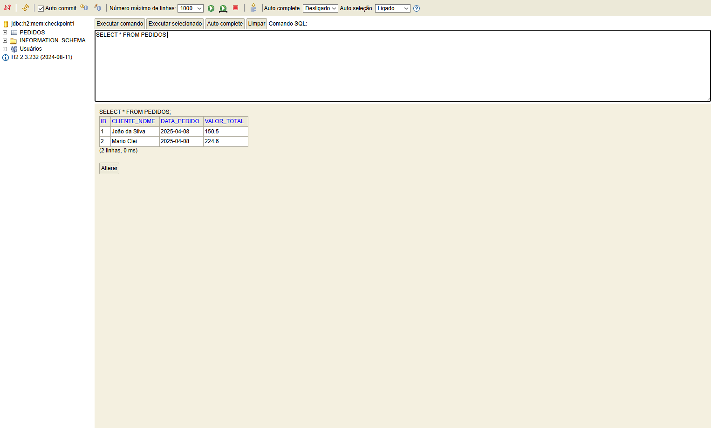

# API de Pedidos - Checkpoint 1

API RESTful para cadastro e gerenciamento de pedidos de clientes, desenvolvida em Spring Boot 3 com banco de dados H2 (em memória).

## Requisitos
- Java 17
- Maven

## Como Executar
1. Navegue até a pasta do projeto
2. Execute o comando: `mvn spring-boot:run`
3. Acesse o Banco de Dados da API em: <http://localhost:8080/h2-console/login.do>
4. Acesse os pedidos da API em: <http://localhost:8080/pedidos>

## Como acessar o Banco de Dados:

Em **JDBC URL** cole `jdbc:h2:mem:checkpoint1` e depois clique em "connect".


## Endpoints

| Método | Endpoint          | Descrição                     |
|--------|-------------------|-------------------------------|
| GET    | /pedidos          | Lista todos os pedidos        |
| GET    | /pedidos/{id}     | Busca pedido por ID           |
| POST   | /pedidos          | Cria novo pedido              |
| PUT    | /pedidos/{id}     | Atualiza pedido existente     |
| DELETE | /pedidos/{id}     | Remove pedido                 |

## Exemplos de Requests/Responses

### 1. Criar Novo Pedido (POST)
**Endpoint:**  
`POST http://localhost:8080/pedidos`

**Corpo da Requisição (JSON):**
```json
{
    "clienteNome": "João da Silva",
    "valorTotal": 150.50
}
```

**Campos Obrigatórios:**

- `clienteNome` (string, não vazio)

- `valorTotal` (número, não negativo)

**Exemplo no Postman:**


### 2.  Listar Todos Pedidos (GET)
**Endpoint:**  
`GET http://localhost:8080/pedidos`

**Resposta de Sucesso (200 OK):**
```json
[
    {
        "id": 1,
        "clienteNome": "Junior Carvalho Monteiro",
        "dataPedido": "2025-01-23",
        "valorTotal": 99.9
    },
    {
        "id": 2,
        "clienteNome": "Catarina Galdino",
        "dataPedido": "2025-01-24",
        "valorTotal": 320.0
    }
]
```

**Exemplo no Postman:**


**Resposta via Query no Banco de Dados:**


### 3.  Buscar Pedido por ID (GET)
**Endpoint:**  
`GET http://localhost:8080/pedidos/{id}`

**Exemplo:**  
`GET http://localhost:8080/pedidos/5`

**Resposta de Sucesso (200 OK):**
```json
{
    "id": 5,
    "clienteNome": "Mariana Chaves",
    "dataPedido": "2023-06-15",
    "valorTotal": 150.50
}
```

**Exemplo no Postman:**


**Resposta via Query no Banco de Dados:**



### 4.  Atualizar Pedido (PUT)

**Endpoint:**  
`PUT http://localhost:8080/pedidos/{id}`

**Observação:** O `id` no corpo da requisição deve coincidir com o `id` da URL.

**Corpo da Requisição: ATUALIZADO**
```json
{
    "id": 5,
    "clienteNome": "Mariana Cristina Chaves",
    "dataPedido": "2023-06-15",
    "valorTotal": 150.50
}
```

**Exemplo no Postman:**

**ANTES**


**DEPOIS**


### 5.  Deletar Pedido (DELETE)
**Endpoint:**  
`DELETE http://localhost:8080/pedidos/{id}`

Resposta de Sucesso:
`204 No Content`


**Exemplo no Postman:**


**Resposta via Query no Banco de Dados:**


